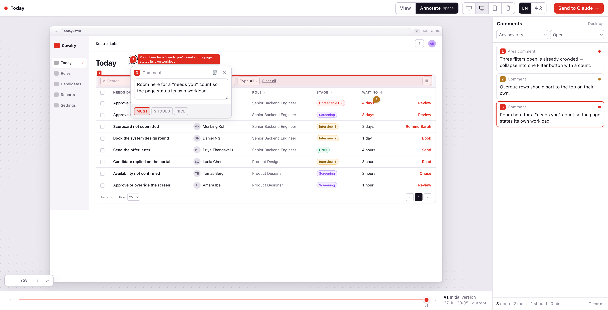
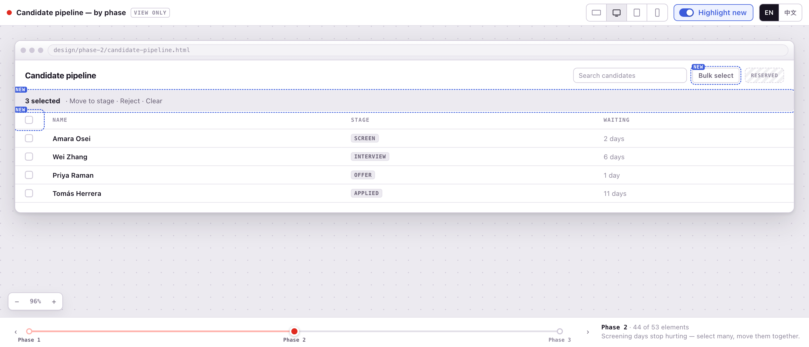

# Visual Stack

**Plan, design, and build software visually — with Claude Code.**
By [Cavalry Collective](https://cavalry.sg).

Visual Stack is a set of [Claude Code](https://claude.com/claude-code) skills that put the work itself in front of you — a story map you rearrange, a design you comment on — and feed every change straight back to Claude. No screenshots, no copy/paste, no describing a layout in prose.

---

## Install

```
/plugin marketplace add Cavalry-Collective/visual-stack
/plugin install vstack@cavalry-collective
```

One install, every skill — including the ones we haven't shipped yet.

---

## The workflow

Start the project, design the screens, map the releases, see each phase — one visual thread from plan to execution.

| Skill | Why you'll want it |
| --- | --- |
| `/vstack:init` | New project, one page of choices, done. Powered by [`cavalry-template-spa`](https://github.com/Cavalry-Collective/cavalry-template-spa). |
| `/vstack:wireframe` | Comment right on the design. Watch the next version appear. |
| `/vstack:user-story-map` | Drag stories between releases until the plan feels right. Claude replans around it. |
| `/vstack:phase-wireframe` | Everyone approved the mockup — now see what Phase 1 actually looks like. |

More on the way — ⭐ watch the repo.

### Design review, directly on the page



See it for yourself: open [`examples/wireframe.html`](examples/wireframe.html) in a browser.

### Release planning on a live story map


See it for yourself: open [`examples/shopping-checkout.html`](examples/shopping-checkout.html) in a browser.

### See each release phase before you build it



Scrub the timeline to watch a release take shape — **Highlight new** marks what each phase adds.

---

## Adding a skill

Drop a directory with a `SKILL.md` under `plugins/vstack/skills/<name>/` and it ships as `/vstack:<name>`. That's it.

Want just one skill, no plugin? Copy it straight in:

```bash
git clone https://github.com/Cavalry-Collective/visual-stack.git
cp -R visual-stack/plugins/vstack/skills/<skill-name> ~/.claude/skills/
```

---

## License

[MIT](LICENSE)
