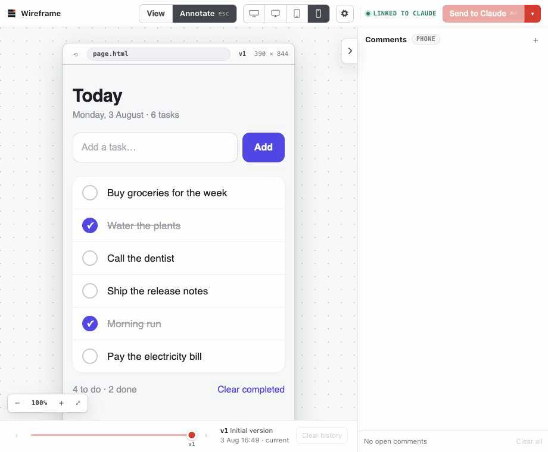

# Visual Stack

## Stop prompting. Start pointing.

Visual Stack adds a Figma-like feedback layer to AI coding agents.

Create a wireframe or open an existing UI in Visual Stack. Then click anywhere and leave comments like:

> "claude its 3am just align the buttons"
>
> "why is everything a card. who hurt you"
>
> "pls undo the series b dashboard energy we have 4 users"

Your agent applies the feedback and updates the design in the same place.

**No more switching back and forth between chat and the UI.**

Just point. Comment. Iterate.



## Get started

### Claude Code

Run these commands in Claude Code:

```text
/plugin marketplace add Cavalry-Collective/visual-stack
/plugin install vstack@cavalry-collective
```

Then create your first wireframe:

```text
/vstack:wireframe Build a mobile checkout screen with Apple Pay.
```

### Codex

Run these commands in your terminal:

```text
codex plugin marketplace add Cavalry-Collective/visual-stack
codex plugin add vstack@cavalry-collective
```

Start a new Codex thread, then run:

```text
$vstack:wireframe
```

## What you can do

- Generate wireframes from plain English.
- Click any element and leave feedback in context.
- Stay on the canvas as your agent publishes each update.
- Work in a familiar, Figma-like interface.
- Preview desktop, tablet, and mobile layouts.
- Compare revisions.
- Open an existing app or website and comment directly on the interface.
- Save and reopen wireframes as project files.

## Why Visual Stack?

Design feedback is spatial. Chat is linear.

As feedback becomes more visual, chat becomes the bottleneck. Context gets buried in long
conversations. Screenshots go stale. Describing which element you mean becomes the work.

Visual Stack keeps every comment attached to the element, route, and version it refers to. Your
agent receives the feedback with the visual context intact.

## Requirements

- A current version of Claude Code or Codex
- A supported Node.js LTS release
- Git
- A local web browser

## Contribute

Visual Stack is open source and under active development. Expect rough edges and breaking changes.

Feedback and contributions are welcome.

- [Report an idea or bug](https://github.com/Cavalry-Collective/visual-stack/issues)
- [Read the contribution guide](CONTRIBUTING.md)
- [Report a security issue](SECURITY.md)

---

Built by [Cavalry Collective](https://cavalry.sg). Licensed under the [MIT License](LICENSE).
