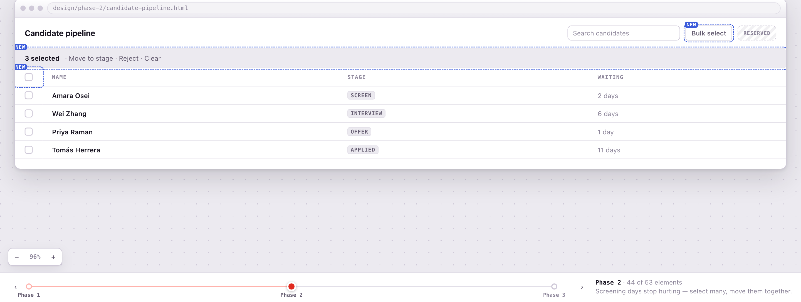

# Visual Stack

**Your specs just became interactive.**

No more spec fatigue. Drag stories into releases, comment directly on the screen, and scrub through
what ships in each phase. Watch the product take shape as Claude builds it.

Visual Stack turns Claude Code’s specifications, designs, plans, and progress into interactive
workspaces where you make decisions directly. Every change returns to Claude with the structured
context intact.

No annotated screenshots, copy-and-paste handoffs, or long explanations of which part of the page
you mean.

Built by [Cavalry Collective](https://cavalry.sg).

---

## Install

Run these commands in Claude Code:

```text
/plugin marketplace add Cavalry-Collective/visual-stack
/plugin install vstack@cavalry-collective
```

The plugin installs the complete workflow.

---

## The workflow

Use the whole sequence or enter at the stage that matches the work in front of you.

| Skill | What it does |
| --- | --- |
| `/vstack:go` | Reads the conversation, repository, and current pipeline, then suggests the right next stage |
| `/vstack:start` | Sets up a new project or records an existing one through a guided form |
| `/vstack:wireframe` | Builds or opens a screen in a workspace where you can comment directly on it — including an app that is already running |
| `/vstack:spec` | Turns the product into a drill-down tree of epics, stories, and acceptance criteria |
| `/vstack:user-story-map` | Arranges stories across the user journey and release phases |
| `/vstack:phase-preview` | Shows what an approved screen contains at each release phase |
| `/vstack:phase-build` | Plans a phase as endpoints, components, and resources, then follows the build |

`/vstack:start` uses the
[`vstack-template-base`](https://github.com/Cavalry-Collective/vstack-template-base) project template
for full development setup. It can also create a specs-and-design workspace or connect an existing
codebase without restructuring it.

### Review the design


Comments stay attached to the element under review. Claude receives the comment, applies the change,
and publishes the next version into the same workspace.

The same workspace also reviews a UI that already exists — an app on localhost, or a website on the
internet. It proxies the target into the canvas, so you click through the real screens and comment on
them. Each comment remembers the route it was made on, and a round changes the source rather than a
mockup.

[Open the wireframe example](examples/wireframe.html).

### Shape the specification


Open at the headlines, inspect what matters, and remove what the product does not need.

### Plan releases


Move a story between phases or activities and Claude replans around the new release boundary.

[Open the story-map example](examples/shopping-checkout.html).

### See each phase before building it



Drag through the release timeline to see the approved screen fill in phase by phase. Highlighting
shows exactly what the selected phase adds.

### Follow the build


Approve the plan, then follow each endpoint, component, and resource as it is built.

---

## Specs are context, not the interface

Spec-driven development solves a real problem: Claude works better when the goal, scope, and
acceptance criteria are clear. The problem starts when every decision produces another document to
read, reconcile, and maintain.

AI did not invalidate the ways product teams already know how to work. A wireframe reveals problems
that prose misses. A story map makes release boundaries tangible. A prototype invites better
feedback than a description of one. A visible board makes progress understandable without another
status report.

Visual Stack keeps the useful part of specs—the structured context—while returning the work to tools
people can use directly. The files remain plain and portable. They simply stop being the only
interface.

---

## Works with the tools you already use

Visual Stack reads and writes plain files. It installs no hooks, claims no ownership of `specs/`, and
does not require a particular specification system.

Use it with ordinary Claude Code or alongside tools such as Spec Kit and Superpowers. Existing
projects can adopt it without moving their code.

---

## Update checks

Each tool's local server asks GitHub once, when it starts, whether a newer Visual Stack has been
published, and the page shows one dismissable line if there is. It is a plain `GET` of the plugin
manifest on the default branch — nothing is sent, the answer is cached for six hours, and a failure
is silent. Turn it off with `VSTACK_NO_UPDATE_CHECK=1`.

To take an update:

```text
/plugin marketplace update cavalry-collective
/plugin update vstack@cavalry-collective
/reload-plugins
```

Or turn on auto-update once, under `/plugin` → **Marketplaces** → `cavalry-collective`. Third-party
marketplaces ship with it off, so nothing updates in the background until you say so.

**Releasing:** `plugins/vstack/.claude-plugin/plugin.json` deliberately carries no `version`. Claude
Code then keys updates on the git commit a copy was installed from, so every push to `main` is a
release and nothing has to be bumped by hand. The check above compares the same thing — the SHA
recorded for your install against the head of `main` — so the banner and Claude Code always agree.
Adding a `version` back would switch both to that field, and then it has to be bumped every release
or nothing ships.

---

## Requirements

- A current version of Claude Code
- A supported Node.js LTS release available as `node`
- A local web browser
- Git, and optionally the GitHub CLI when `/vstack:start` creates a GitHub repository

Claude-in-Chrome is optional. It improves capture from reference websites, but the Visual Stack
workspaces themselves run in a normal browser.

---

## Development

The plugin lives under [`plugins/vstack/`](plugins/vstack/). Skills are installed together because
the later workflow stages share browser shells and bridge code.

Add a skill under:

```text
plugins/vstack/skills/<name>/SKILL.md
```

It becomes available as `/vstack:<name>`.

Before opening a pull request, read [`CONTRIBUTING.md`](CONTRIBUTING.md) and run:

```bash
claude plugin validate .
node plugins/vstack/lib/build-shell.mjs check
```

---

## Support

- Found a bug or unclear instruction? [Open an issue](https://github.com/Cavalry-Collective/visual-stack/issues).
- Want to contribute? Read [`CONTRIBUTING.md`](CONTRIBUTING.md).
- Found a security problem? Follow [`SECURITY.md`](SECURITY.md) and report it privately.

Community participation is governed by [`CODE_OF_CONDUCT.md`](CODE_OF_CONDUCT.md).

## License

[MIT](LICENSE)
