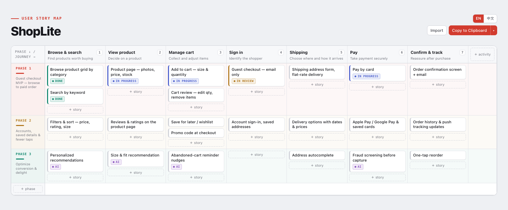

# Cavalry Collective — Claude Code Skills

Skills for [Claude Code](https://claude.com/claude-code), published by [Cavalry Collective](https://github.com/Cavalry-Collective).

## user-story-map

Ask Claude for a story map and it builds a **self-contained, interactive user story map** you can operate in the browser — no external dependencies, published as a Claude Artifact (or saved as a plain HTML file).



*Example: a mobile shopping app's checkout flow — the columns are the shopper's journey, the rows are release phases, and the cards are stories you can drag between them. Open [`examples/shopping-checkout.html`](examples/shopping-checkout.html) in a browser to try this exact map.*

### What you can do on the map

- **Drag a card into any cell** to re-slice which phase & activity a story belongs to; drop above/below other cards to rank it
- **Drag a phase rail or activity header** onto another to reorder rows & columns
- **Double-click any text** to edit inline; `＋ story` / `＋ Phase` / `＋ Activity` to grow the map
- **Tag cross-cutting themes** (e.g. `AI`) via the ⌗ menu on each card — add a tag to a card, create new tags, or delete a tag from the whole map
- **EN / 中文 toggle** for the UI language
- **Copy JSON / Download / Import / Reset** — export the re-sliced map as JSON and paste it back to Claude to regenerate your downstream plan or tickets; edits persist in the browser's `localStorage`

### Install

As a Claude Code plugin (recommended):

```
/plugin marketplace add Cavalry-Collective/claude-skills
/plugin install cavalry@cavalry-collective
```

Or manually — copy the skill into your skills directory:

```bash
git clone https://github.com/Cavalry-Collective/claude-skills.git
cp -R claude-skills/plugins/cavalry/skills/user-story-map ~/.claude/skills/
```

### Use

Once installed, invoke it as a slash command (the `cavalry` plugin namespaces its skills):

```
/cavalry:user-story-map build a map for our mobile shopping app's checkout flow, three release phases
```

Or just ask in natural language — the skill triggers whenever you ask for a story map, phased roadmap, or release slicing:

> Build a user story map for our mobile shopping app's checkout flow, three release phases.

Claude infers the three axes from your spec / plan / conversation — **activities** (the user journey, left→right), **phases** (release order, top→bottom), and **stories** (the cards) — fills the template, and publishes it. When you're done re-slicing, hit **Copy JSON** and paste the result back so Claude can regenerate the plan from your arrangement.

### Data format

The map is driven by one JSON block:

```json
{
  "title": "ShopLite",
  "lang": "en",
  "tags": ["AI"],
  "activities": [{ "id": "a1", "name": "Browse & search", "task": "Find products worth buying" }],
  "phases":     [{ "id": "ph1", "name": "Phase 1", "goal": "Guest checkout MVP" }],
  "stories":    [{ "id": "s1", "activity": "a1", "phase": "ph1", "text": "Search by keyword", "tags": [] }]
}
```

Array order is display order; story order within a cell is its rank. Colours are auto-assigned per phase. `lang` (`"en"`/`"zh"`) sets the initial UI language.

## License

[MIT](LICENSE)
