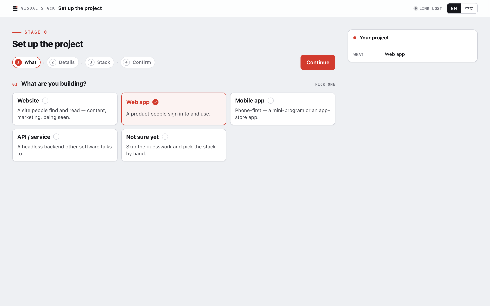
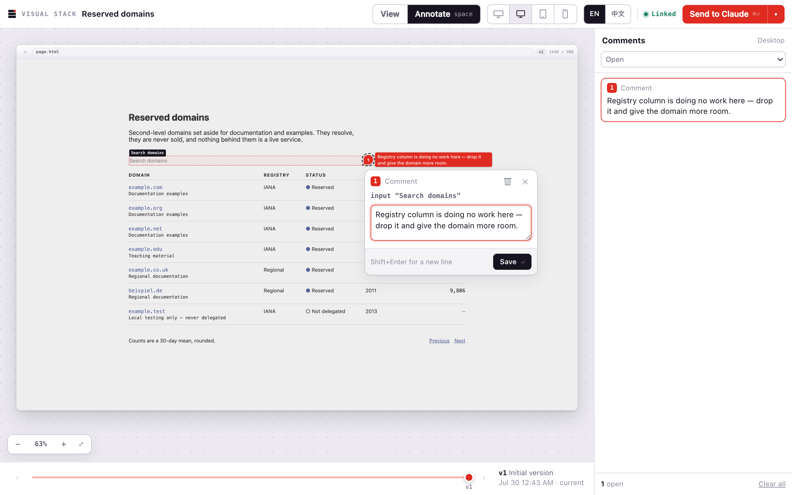
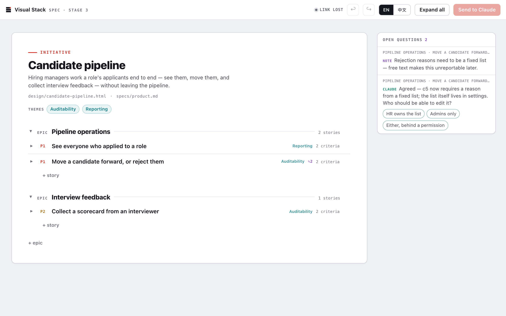
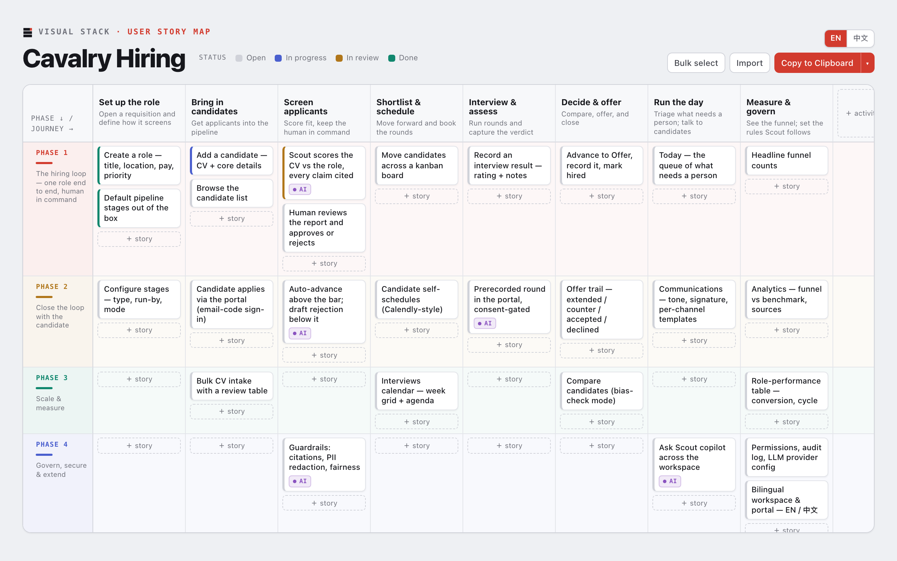
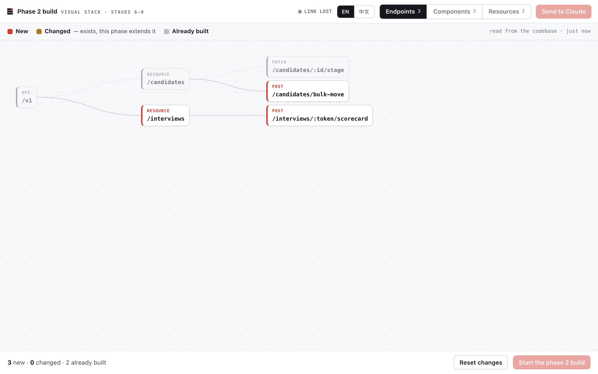

# Visual Stack

**Visual-first planning, design and delivery for Claude Code.**

By [Cavalry Collective](https://cavalry.sg).

Claude Code is extraordinarily capable. Working with it can still feel like operating the future
through a terminal.

Visual Stack gives Claude Code an interface from this decade. It turns each stage of delivery into an
interactive page: comment directly on a design, prune a specification, rearrange a story map or
explore what each release will contain.

Change the work directly, and Claude receives those changes automatically.

---

## Install

Run these two commands in Claude Code:

```text
/plugin marketplace add Cavalry-Collective/visual-stack
/plugin install vstack@cavalry-collective
```

One installation gives you every currently available Visual Stack skill.

---

## The workflow

Move from the first project decisions to a running build through one continuous visual workflow.

| Skill | What it gives you |
| --- | --- |
| `/vstack:go` | Reads the conversation, the repository and the current pipeline, then takes you to the right stage. |
| `/vstack:start` | Start a project from one page of decisions — from a template, as a design-only workspace, or by connecting an existing codebase. Powered by [`vstack-template-base`](https://github.com/Cavalry-Collective/vstack-template-base). |
| `/vstack:wireframe` | Review the design itself, comment on what should change and receive the next version. |
| `/vstack:spec` | Explore epics, stories and acceptance criteria as a drill-down tree. Prune what you don't need. |
| `/vstack:user-story-map` | Arrange the user journey, move stories between releases and let Claude replan around your decisions. |
| `/vstack:phase-wireframe` | Turn an approved design into a visual definition of what each release phase will deliver. |
| `/vstack:phase-build` | Approve the build plan and follow each endpoint and component as it lands. |

More of the delivery workflow is on the way. ⭐ Watch the repository to follow new releases.

### Set up the project



Decisions on a form instead of a questionnaire in the terminal.

### Review the design itself



Comments stay attached to the page under review, so Claude knows exactly what you want changed.

Try it: open [`examples/wireframe.html`](examples/wireframe.html) in a browser.

### Shape the specification



Open at the headlines, drill into what matters, prune the rest.

### Plan releases on a live story map



Move a story between releases and Claude replans around the decision.

Try it: open [`examples/shopping-checkout.html`](examples/shopping-checkout.html) in a browser.

### See each release before you build it


Scrub through the timeline to watch the product take shape. **Highlight new** shows exactly what each
phase adds.

### Watch the system take shape



Approve the plan, then follow each endpoint and component as it lands — new, changed or already
built, without a running commentary in the terminal.

---

## Why visual-first?

**AI moved software forward. Its interface moved backward.**

Spec-driven development got the principle right: agree on what you are building before you build it.

Then it buried that agreement in text.

A specification here. A plan there. A task list underneath. Soon the team is surrounded by documents
that get skimmed, approved to be polite and contradicted by the code three days later.

The review that mattered never happened.

Visual Stack changes the medium. Each stage becomes something you operate instead of something you
merely read:

- **Work on the artifact.** Review the screen, story map or release phase itself — not a written
  description of it.
- **Change what is wrong.** A comment, edit or move becomes the feedback.
- **Keep Claude connected.** Changes made on the page flow back to the Claude Code session.
- **Share one source of truth.** The interactive artifact defines the plan instead of illustrating a
  separate document.

It brings the oldest idea in the [Agile Manifesto](https://agilemanifesto.org/) — *working software
over comprehensive documentation* — into the planning process itself.

Prose still has a place. It just should not be the interface for everything.

---

## Keep the tools that already work

Visual Stack adds a visual operating layer to your existing workflow. It does not ask you to abandon
the spec-driven tools, repositories or conventions your team already uses.

Plain files in, plain files out — markdown specs, HTML mockups, and one state folder of its own
(`.vstack/`). It installs no hooks, adds no config and claims no ownership of `specs/` or anything
else. Use it with plain Claude Code, beside Spec Kit, under Superpowers; nothing here intercepts or
interferes.

**Want a bare `/vstack`?** Plugin skills are always namespaced, but a personal skill isn't:

```bash
mkdir -p ~/.claude/skills/vstack
cp plugins/vstack/skills/go/SKILL.md ~/.claude/skills/vstack/SKILL.md
sed -i '' 's/^name: go$/name: vstack/' ~/.claude/skills/vstack/SKILL.md
```

---

## Adding a skill

Add a directory containing a `SKILL.md` file under:

```text
plugins/vstack/skills/<name>/
```

It will be available in Claude Code as:

```text
/vstack:<name>
```

Want one skill without installing the plugin? Copy it into your Claude Code skills directory:

```bash
git clone https://github.com/Cavalry-Collective/visual-stack.git
cp -R visual-stack/plugins/vstack/skills/<skill-name> ~/.claude/skills/
```

`spec` and `phase-build` also need the shared engine — copy `plugins/vstack/lib/` to `~/.claude/lib/`
as well, or install the plugin instead.

---

## Brand

The mark and lockup live in [`docs/brand/`](docs/brand). Regenerate them with
`node scripts/generate-brand-assets.mjs`.

---

## License

[MIT](LICENSE)
