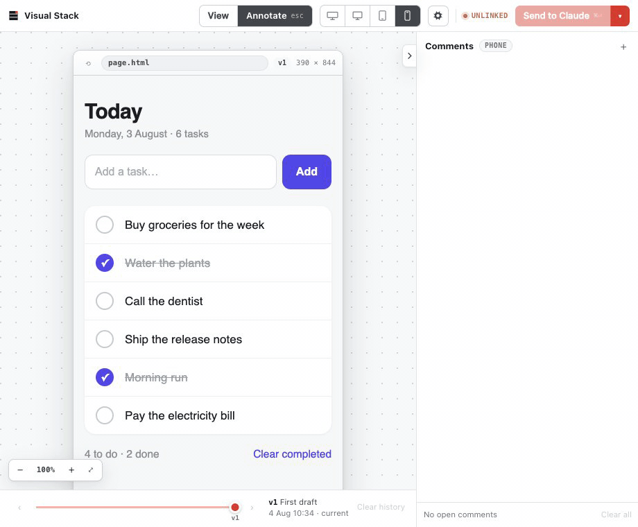

# Visual Stack

## Stop prompting. Start pointing.

Visual Stack adds a Figma-like feedback layer to AI coding agents, because typing “the button on the left, no, the other left” was not a sustainable workflow.

Create a wireframe or open an existing UI in Visual Stack. Click anywhere and leave highly professional feedback such as:

> "claude its 3am just align the buttons"
>
> "why is everything a card. who hurt you"
>
> "pls undo the series b dashboard energy we have 4 users"
>
> "this modal has the emotional weight of a tax audit"
>
> "make it pop but not like that"
>
> "the padding is now between you and god"

Your agent applies the feedback and updates the design in the same place, hopefully without adding another gradient.

**No more switching back and forth between chat and the UI like a hamster on coke.**

Just point. Comment. Iterate. Question your career choices slightly less.



## Get started

### Claude Code

Run these commands in Claude Code:

```text
/plugin marketplace add Cavalry-Collective/visual-stack
/plugin install vstack@cavalry-collective
```

Then create your first wireframe:

```text
/vstack:wireframe Build a mobile checkout screen with Apple Pay.
```

Claude will build something. You will have opinions. Visual Stack handles the rest.

### Codex

Run these commands in your terminal:

```text
codex plugin marketplace add Cavalry-Collective/visual-stack
codex plugin add vstack@cavalry-collective
```

Start a new Codex thread, then run:

```text
$vstack:wireframe
```

Try not to begin with “make it like Stripe, but different.”

## What you can do

- Generate wireframes from plain English.
- Click any element and leave feedback exactly where the problem is hiding.
- Stay on the canvas as your agent publishes each update.
- Work in a familiar, Figma-like interface.
- Preview desktop, tablet, and mobile layouts before production does it for you.
- Compare revisions and identify the exact moment things went wrong.
- Open an existing app or website and comment directly on the interface.
- Save and reopen wireframes as project files.
- Replace “you know what I mean” with actual context.

## Why Visual Stack?

Design feedback is spatial. Chat is linear. Humans are tired.

As feedback becomes more visual, chat becomes the bottleneck. Context gets buried in long conversations. Screenshots go stale. Describing which element you mean becomes a small detective novel.

Visual Stack keeps every comment attached to the element, route, and version it refers to. Your agent receives the feedback with the visual context intact.

No archaeology through 200 messages. No screenshot named `final-final-v2-actually-final.png`. No arguing about which blue.

## Requirements

- A current version of Claude Code or Codex
- A supported Node.js LTS release
- Git
- A local web browser
- At least one strong opinion about border radius

## Contribute

Visual Stack is open source and under active development. Expect rough edges, breaking changes, and occasional moments of character development.

Feedback and contributions are welcome.

- [Report an idea or bug](https://github.com/Cavalry-Collective/visual-stack/issues)
- [Read the contribution guide](CONTRIBUTING.md)
- [Report a security issue](SECURITY.md)

---

Built by [Cavalry Collective](https://cavalry.sg), presumably after one too many rounds of screenshot-based feedback.

Licensed under the [MIT License](LICENSE).
